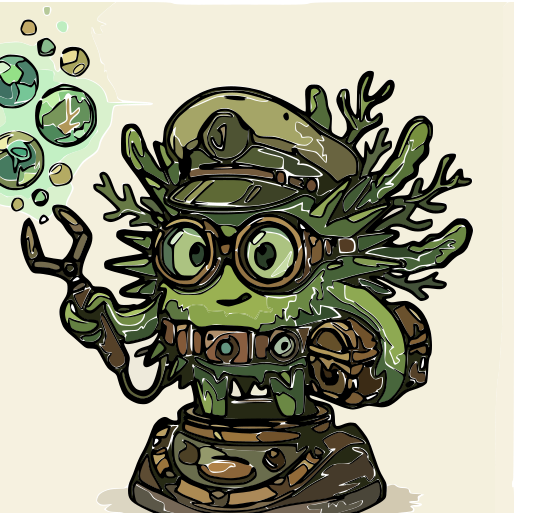

# 🟢 Dechinus WM



**Tagline / Catchphrase:** *“Tame your windows, ride the urchin!”*

> ⚠️ **Legacy Note:** Dechinus is a fork of **Echinus**, which is now unmaintained. We honor its legacy while actively maintaining and improving the project.

## Overview

**Dechinus** is a lightweight, tiling window manager for **X11**, forked from **Echinus**. It retains the original speed and minimalism, but adds:

* **Active maintenance** and ongoing improvements
* **Custom branding** (green urchin mascot)
* **Updated defaults and better configurability**

> Your mascot represents nimbleness, adaptability, and control — qualities that define Dechinus.

## Features

* Lightweight & fast, minimal dependencies
* Highly configurable layouts, gaps, titlebars, and modkeys
* Panels and tagbars fully configurable
* Portable setup: configurations stored in your home directory
* Legacy of **Echinus** maintained, but actively improved

## Installation

Dependencies: `X11`, `Xft`, `pkg-config`. Optional for multihead setups: `libxrandr`.

```bash
# Clone the repository
git clone https://github.com/your-username/dechinus.git
cd dechinus

# Build & install
make
sudo make install

# Setup initial config
mkdir -p ~/.dechinus
cp -r CONFDIR ~/.dechinus
```

> Adjust `~/.dechinus/dechinusrc` to set your layouts, gaps, and master window size.

## Configuration

### Main Settings

| Setting              | Description                                                                  | Example |
| -------------------- | ---------------------------------------------------------------------------- | ------- |
| `Dechinus*deflayout` | Default layout: i=ifloating, f=floating, t=tiled, b=bottomstack, m=maximized | `t`     |
| `Dechinus*gap`       | Gap between windows (pixels)                                                 | `5`     |
| `Dechinus*mwfact`    | Fraction of master area                                                      | `0.55`  |
| `Dechinus*nmaster`   | Number of master clients                                                     | `1`     |
| `Dechinus*sloppy`    | Focus behavior: 0=click, 1=sloppy floating, 2=sloppy all, 3=sloppy+raise     | `1`     |
| `Dechinus*modkey`    | Modifier key: A=Alt, W=Win, S=Shift, C=Ctrl                                  | `W`     |

### Title Settings

* `Dechinus*decoratetiled` – Show titlebars in tiled mode (1/0)
* `Dechinus*titlelayout` – Titlebar format (`"N  IMC"` for tags, icons, master, client)

Full options are in `config.h` and `dechinusrc`.

## Panels & Tagbars

* Fully configurable for status, time, CPU, etc.
* Supports custom scripts and widgets.

## Legacy Acknowledgement

**Echinus** was the original lightweight tiling window manager that inspired Dechinus. While Echinus is no longer maintained, its legacy lives on in Dechinus, now actively maintained and improved.

## Mascot & Branding

Include your green urchin mascot in the repository:

```text
assets/
├── mascot.png  # Green urchin mascot
├── banner.png  # Optional banner image
```

## Contributing

Contributions are welcome! Fork, tweak layouts, fix bugs, and submit pull requests. Dechinus is **actively maintained**, unlike its predecessor.

## License

**MIT License** — See [LICENSE](./LICENSE) for full details.
